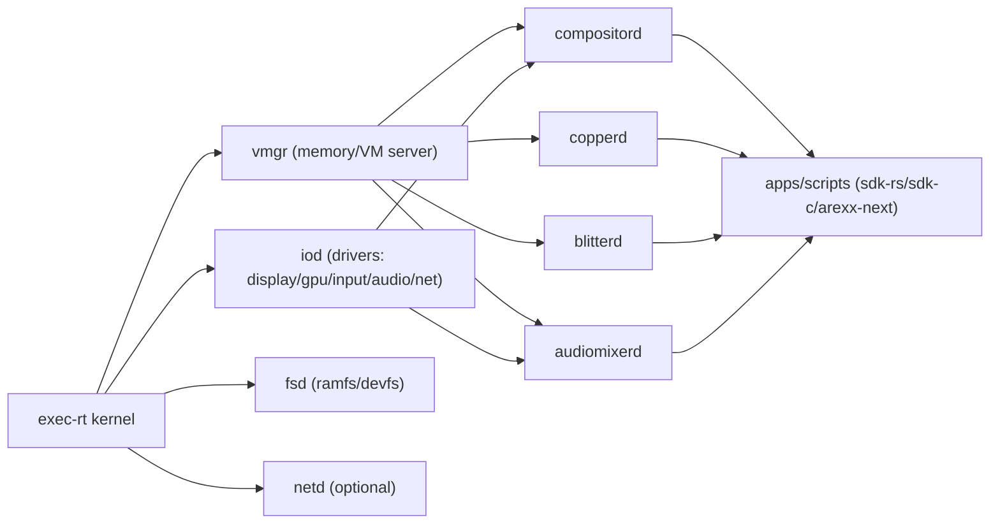

# exec-rt

**CopperlineOS microkernel (real‑time oriented).**  
`exec-rt` is a small, capability‑based microkernel written in Rust. It’s the future home of CopperlineOS once the Phase‑0 Linux‑hosted stack is stable. The goal is to take the low‑latency, deterministic feel we built on Linux and make it **native**: user‑space drivers, message‑passing IPC, hard real‑time scheduling classes, and tight integration with Copperline’s media timeline.

> TL;DR: a tiny kernel that runs `compositord`, `copperd`, `blitterd`, and friends as user tasks, with a predictable scheduler and a ports‑style IPC—no giant monolith required.

---

## Goals

- **Determinism**: frame/period‑oriented scheduling, low jitter, deadline telemetry.  
- **Safety**: memory‑safe Rust in the kernel, capabilities for every privileged operation.  
- **Simplicity**: message‑passing microkernel; drivers live in user space.  
- **Compatibility**: keep the **ports** protocol shape so Phase‑0 apps and scripts need minimal changes.  
- **Pragmatism**: boot on commodity PCs first (UEFI), then SBCs; great QEMU story.

**Non‑goals (for now)**: POSIX compliance, multi‑user UNIX environment, rich filesystems in kernel, legacy syscalls.

---

## Big picture



<details>
<summary>Text-only fallback</summary>

```
kernel -> { vmgr, iod, fsd, netd } -> { compositord, copperd, blitterd, audiomixerd } -> apps
```
</details>

- The **kernel** handles CPU scheduling, address spaces, IPC primitives, and minimal interrupt plumbing.  
- **Servers** provide higher‑level services (VM manager, drivers, files, network).  
- **Copperline services** run unmodified (modulo transport), talking over **ports‑rt** IPC.

---

## Process & IPC model

- **Task**: an address space + threads. Tasks have capabilities (caps) granting operations: map memory, open a device queue, create a port, etc.  
- **Ports‑RT**: a minimal message API inspired by Phase‑0 ports (request/response + event streams). Messages are small, copied between tasks; large buffers use **grants** (shared memory).  
- **Grants**: sender maps a region read‑only or read‑write into the receiver (think “DMABUF‑like” but OS‑native).  
- **Notifications**: lightweight, O(1) signals used for wakeups and IRQ delivery to driver tasks.

**API sketch (subject to change):**

```rust
// kernelspace (syscalls) — pseudo-Rust
port_create() -> Port;
port_send(port: Port, buf: &[u8], handles: &[Handle]) -> Result<()>;
port_recv(port: Port, buf: &mut [u8], deadline: Option<Instant>) -> Result<Event>;
grant_create(region: &mut [u8], perms: Perm) -> GrantHandle;
grant_map(task: Task, gh: GrantHandle, perms: Perm) -> MappedRegion;
```

User libraries in `sdk-rs` / `sdk-c` will wrap this in familiar clients.

---

## Scheduling

Three scheduling classes, preemptive, SMP‑aware:

- **RT** — fixed‑priority, preemptive (like FIFO/RR), used by `compositord` and device audio.  
- **DL** — *deadline‑aware* (EDF‑like) for periodic work (e.g., `copperd` tick, audio periods).  
- **BE** — best‑effort (CFS‑like) for tools and non‑critical tasks.

**Telemetry**: kernel records runtime/latency per dispatch; `timeline-inspect` can query live stats.

---

## Memory model

- **Per‑task address spaces** with demand‑paging optional (start with simple bump alloc + fixed mappings).  
- **Grants** for zero‑copy buffers between tasks (backed by contiguous or page‑mapped memory).  
- **Guarded** mappings: caps define who can map what and with which permissions.

---

## Device & driver model

- **User‑space drivers**: display/KMS, input (evdev‑like), audio (PCI/USB), network.  
- **I/O queues**: lock‑free rings shared with the kernel; IRQs delivered as notifications.  
- **GPU**: initial target is a **display‑only** KMS driver with a simple scanout path; full Vulkan is out of scope initially (use a helper GPU via passthrough or software).  
- **Storage**: ramfs/devfs in user space; block drivers later.

---

## Boot & bring‑up

1. **UEFI** loader → enter 64‑bit mode, map memory, jump to kernel.  
2. Kernel sets up APIC/SMP, timers, memory manager, and the root task.  
3. Root starts servers: `vmgr`, `iod`, `fsd`.  
4. Start Copperline services (`compositord`, `copperd`, `blitterd`, `audiomixerd`).  
5. Launch `init` (shell or demo).

**Emulation:** great first‑run target is **QEMU** (virtio‑gpu for scanout, AC97/HDA for audio).

---

## Compatibility with Phase‑0

- The **message shape** matches ports v0, so Phase‑0 apps can be adapted via a thin transport shim.  
- SDKs (`sdk-rs`, `sdk-c`) get an `exec-rt` transport behind a feature flag.  
- Services keep their public APIs (create_layer, set_regs, load/start, etc.).

---

## Building (early PoC)

> Expect this to change quickly. The PoC is not ready for production use.

### Prereqs

- **Rust** stable (no_std friendly) + `cargo`.  
- `llvm-tools-preview` for `cargo-objcopy`.  
- `qemu-system-x86_64` for emulation.  
- `nasm` (if using a hand‑rolled UEFI loader; otherwise use `limine` or `bootloader` crate).

### Steps

```bash
git clone https://github.com/CopperlineOS/exec-rt
cd exec-rt
# Build kernel
cargo build -Z build-std=core,alloc --target x86_64-copperline.json --release

# Run in QEMU (basic serial console)
./scripts/run-qemu.sh
```

Artifacts land in `target/x86_64-copperline/release/`. The `scripts/` folder contains helper launchers for QEMU with a simple ramfs.

---

## Repository layout (proposed)

```
exec-rt/
├─ kernel/                 # no_std Rust kernel
│  ├─ arch/x86_64/         # APIC, timers, paging, traps
│  ├─ sched/               # RT/DL/BE sched classes
│  ├─ ipc/                 # ports-rt, grants, notifications
│  └─ dev/                 # IRQ, PCI, timers
├─ servers/                # user-space (no_std or std) servers
│  ├─ vmgr/                # memory/VM server
│  ├─ iod/                 # display/input/audio/net drivers
│  └─ fsd/                 # ramfs/devfs
├─ userspace/              # compositord/copperd/blitterd/audiomixerd shims
├─ libs/                   # user-mode runtime, syscalls, alloc, sdk glue
├─ tools/                  # qemu runners, symbol tools
├─ boot/                   # UEFI/limine loader or multiboot glue
└─ docs/                   # design notes
```

---

## Example: “hello, port” user task (pseudo-Rust)

```rust
use exec_rt::ipc::{Port, request, subscribe};
use serde_json::json;

fn main() -> anyhow::Result<()> {
    // Connect to compositord
    let comp = Port::connect("/svc/compositord")?;

    // Create a layer
    let resp = request(&comp, json!({"cmd":"create_layer"}))?;
    let id = resp["result"]["id"].as_i64().unwrap();

    // Subscribe to vsync
    let mut vs = subscribe(&comp, json!({"events":["vsync"]}))?;

    // Print 10 vsyncs
    for _ in 0..10 {
        let ev = vs.next()?;
        println!("vsync @ {}", ev["usec"]);
    }
    Ok(())
}
```

---

## Security

- **Capabilities**: every privileged call requires the right cap (create port, map grant, open device).  
- **Resource limits**: per‑task quotas (memory, handles, CPU time).  
- **Isolation**: drivers and services are unprivileged tasks; kernel is minimal.  
- **Crash containment**: tasks can be restarted by a supervisor without rebooting the kernel.

---

## Roadmap

- **v0.1 (PoC)**: boot to shell in QEMU, ports‑rt IPC, basic RAM allocator, single‑core scheduler.  
- **v0.2**: SMP, timers/HPET/APIC, grants, RT scheduling, deadline timers.  
- **v0.3**: display (virtio‑gpu scanout), input (virtio), simple ramfs/devfs.  
- **v0.4**: audio (AC97/HDA), network (virtio‑net), Copperline services running.  
- **v0.5**: capabilities, security hardening, on‑device bring‑up (NUC/mini‑PC).

RFCs and specs will live in [`CopperlineOS/docs`](https://github.com/CopperlineOS/docs) and [`CopperlineOS/rfcs`](https://github.com/CopperlineOS/rfcs).

---

## Contributing

- Expect rapid change—file issues for design questions first.  
- Follow Rust style with `rustfmt`; keep `unsafe` blocks small and well‑commented.  
- Add QEMU tests where possible; CI runs the kernel to a known log line.  
- Be nice! See `CODE_OF_CONDUCT.md`.

---

## License

Kernel and user‑space code are dual‑licensed under **Apache‑2.0 OR MIT**.

---

## See also

- Phase‑0 services: [`copperd`](https://github.com/CopperlineOS/copperd) · [`compositord`](https://github.com/CopperlineOS/compositord) · [`blitterd`](https://github.com/CopperlineOS/blitterd) · [`audiomixerd`](https://github.com/CopperlineOS/audiomixerd)  
- Protocol & SDKs: [`ports`](https://github.com/CopperlineOS/ports) · [`sdk-rs`](https://github.com/CopperlineOS/sdk-rs) · [`sdk-c`](https://github.com/CopperlineOS/sdk-c)
